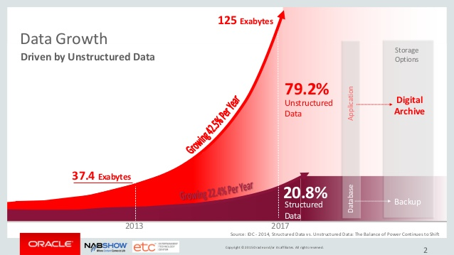
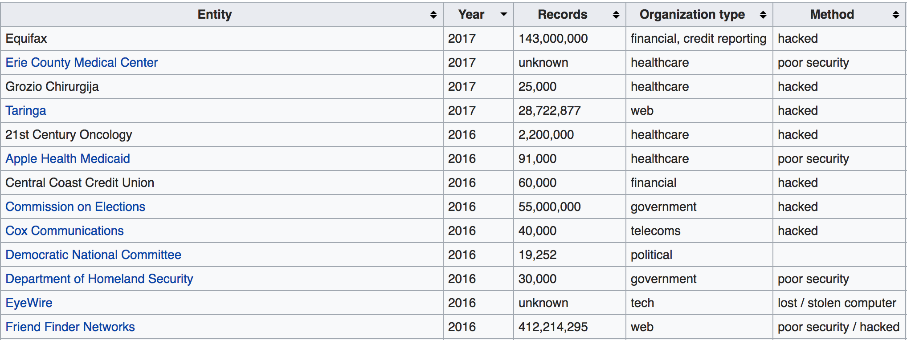

# Computer vision in mobile phones
Mobile phones have become more than just ‘phones’. Not only do they allow us to contact others, but they also carry capture moment we would like to remember forever, notably through pictures. These media can be leveraged to provide unique and personal services to the user through computer vision algorithms. However, they often contain personal data, a valuable information we need to protect. This post explains why and how we can bring such algorithms into a mobile phone, while maintaining user’s privacy.

## A picture is worth a thousand words
Ever wanted to remember forever the crazy atmosphere of Saturday's party with your friends? The liberating moment when you graduate? The cuteness of your cat chasing a laser beam? In most of those cases, you would take a picture or record a video in order to store this memorable instant. Visual multimedia have become an inseparable part of our social lives, and they often capture moments tied with deep affections. 

Beyond text or vocal messaging, It is thus no surprise that pictures became one of the main medium to share not only information, but emotions. Another representative example is the evolution of emojis. It all started with a simple 2 characters combination, but rapidly evolved toward more complex images capturing a wider range of human expressions. Even more recently, [Apple released a novel feature, Animojis](https://www.apple.com/newsroom/2017/09/the-future-is-here-iphone-x/) (which stands for ANImated eMOJIs). With your own face, and a camera, you can re-enacts a 3D object in real-time. Emoji can now emote as much as you can do!

This trend directly impacts the type of data generated every day. Unstructured data (encompassing images, video) have taken over more traditional structured data (eg: Excel files) in the past couple of years. If we look forward, storage being cheaper, and transmission being faster, we may witness soon [(if not already)](https://giphy.com/) the usage of video as a finer degree of expressiveness than pictures. 

## Everything in the palm of your hand
Meanwhile, [the famous Moore's law](https://en.wikipedia.org/wiki/Moore%27s_law) is at work (even though [some are questioning its existence today](http://www.economist.com/node/21693710/sites/all/modules/custom/ec_essay)). Chips keep shrinking at a formidable rate, and, alongside the information revolution, you can now carry in your pocket a computer a million times more powerful than [Apollo's space shuttle](https://en.wikipedia.org/wiki/Apollo_Guidance_Computer). Another striking example is that most recent phones are actually now almost as powerful as their contemporary laptops!

Empowered mobile phones are actually part of a larger trend, the growth of the Internet Of Things (the so-called IoT). More and more devices are now connected, and can be thus remotely controlled (CCTV, smart watch, electric consumption meter etc). Although most of them only gather and transmit data to a central platform which may take an enlightened decision later, some others like Amazon's Alexa onbends machine learning capabilities. Running such algorithms on mobile devices is much more tedious than their counterparts on server, due to the limitation in memory and battery. They enable however functionalities that were previously considered a fantasy: real-time translation from a camera, or specialized image labelling, among others. 

## User privacy at the forefront
The advent of mobile devices came with a curse, security. Protecting user privacy and the access to these numerous devices has become a primary concern. Services storing user data on their server are particularly exposed. For example, [Yahoo! disclosed a breach of all their 3 billions accounts](https://techcrunch.com/2017/10/03/yahoo-says-all-3b-accounts-were-impacted-by-2013-breach-not-1b-as-thought/), (not 1 billion as initially estimated) including telephone numbers, dates of birth, password and more. No matter the sector, data that are centralized are exposed to potential hacks, whether you are [a dating website](https://en.wikipedia.org/wiki/Ashley_Madison_data_breach), an [entertainment company](https://en.wikipedia.org/wiki/Sony_Pictures_hack), or even [the department of defense of the United States](https://en.wikipedia.org/wiki/Iraq_War_documents_leak). Similarly, ill-protected devices can be used for malicious purposes. In September 2016, [the world's largest DDoS (Distributed Denial of Service) attack to date](https://www.ovh.com/us/news/articles/a2367.the-ddos-that-didnt-break-the-camels-vac) used around 150 000 compromised connected devices (CCTV cameras and personal video recorders) against OVH, a French web host provider. And [the list continues](https://en.wikipedia.org/wiki/List_of_cyberattacks).

To mitigate these issues, one can use the concept of "privacy by design". The product (or service) is designed such that the data doesn't need protection, by limiting data transfer from a user to the system. Privacy is brought at the heart of the engineering process. The advantage of porting machine learning algorithms directly onto the mobile are thus 2-folds: first, as described in the previous section, it enables novel functionalities ; second, it prevents data transfer to a potentially compromised server. From a data scientist point of view, we can see popping up more and more machine learning frameworks specialised for mobile devices: [caffe](https://github.com/solrex/caffe-mobile), [tensorflow](https://github.com/tensorflow/tensorflow/tree/master/tensorflow/examples/android), or [Mobile Deep Learning by Baidu](https://github.com/baidu/mobile-deep-learning)

## Resurrect your memories
The ambition of Zyl is to take advantage of state-of-the-art computer vision algorithms to bring back to life your best memories buried in your phone. Wouldn't it be easier to enjoy them by finding a precise moment easily? group automatically your pictures by album? or finding the best portraits of your friends? Such features require deep learning technics brought directly to the user, while everything should stay on his or her mobile. All your photos belong to you, and only you. In an upcoming post, we will explain in more details the kind of technologies we use at Zyl to achieve such functionalities. 

You should spend time living a rich and busy life, we take care of the rest.
