# Review of deep learning algorithms for image classification

**Un petit mot sur pourquoi on change de challenge entre 2012, 2014 et 2015. Quelles différences ? rajouter un petit tableau récapitulatif, avec les perfs, les caractéristiques principales, ou alors une timeline des modèles ?**

## Why do we need image classification?
In the previous post, we praised the advantages of embedded deep learning algorithms into mobile phones. While the applications are numerous, we will focus on computer vision algorithms, the heart of Comet. One of the most popular task of such algorithms is image classification, ie telling which object appears on a picture. Indeed mobile phones host a diverse and rich photo gallery which then become a personal database difficult to manage especially to recover specific events. Users should be able to have a souvenir in their mind and find the associated images in the most efficient way. A first intuitive approach would be to type in a word corresponding to the content of the image. Searching images with words is, from a machine learning point of view, a classification problem with a high number of classes. 

The purpose of this post is to provide a review of the state-of-the-art of image classification algorithms based on the most popular labelled dataset, ImageNet. We will describe some of the innovative architectures which lead to significant improvements.

## The ImageNet challenge
The ImageNet database is the outcome of a collaboration between Stanford University and Princeton University, and has become a reference in the field of computer vision. It contains around fourteen millions images originally labeled with Synsets[^1] of the WordNet lexicon tree. The original challenge
consisted in a simple classification task, each image belonging to a single
category among one thousand, from specific breed of dog to precise
type of food. Although the original challenge is still on-going, it has further evolved to a multi-classification task with bounding boxes around each individual object. This second challenge will not be covered in this post.

*Example of image in ImageNet2012 dataset: Carbonara. Source: [ImageNet](www.image-net.org/)*

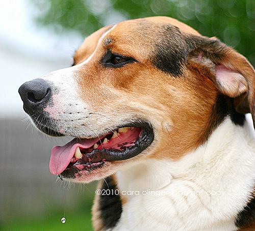*Example of image in ImageNet2012 dataset: English Foxhound. Source: [ImageNet](www.image-net.org/)*

## The advent of deep learning
**The ImageNet challenge has been traditionnally tackled with image analysis algorithms such as SIFT with mitigated results[NOT SURE]** until the late 90s. However, a gap in performance has been brought by using neural networks. Inspired by [Y. Lecun and al (1998)](http://yann.lecun.com/exdb/publis/pdf/lecun-01a.pdf), the first deep learning model published by [A. Krizhevsky and al (2012)](https://papers.nips.cc/paper/4824-imagenet-classification-with-deep-convolutional-neural-networks) drew attention to the public by getting a top-5 error rate of 15.3% outperforming the previous best one with 26.2%. This famous model, the so-called "AlexNet" is what can be considered today as a simple architecture with five consecutive convolutional filters, max-pool layers and three fully-connected layers.

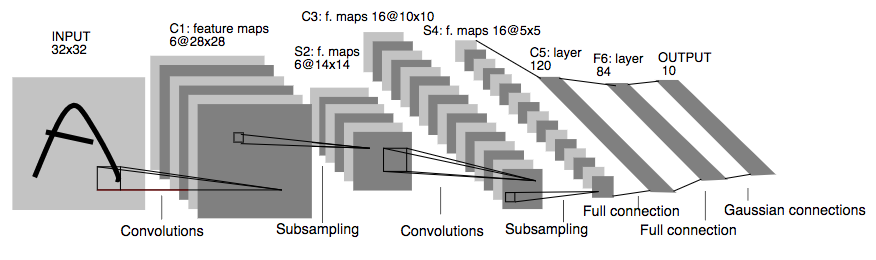*LeNet-5 architecture for digit recognition. Source: [Y. Lecun and al (1998)](http://yann.lecun.com/exdb/publis/pdf/lecun-01a.pdf)*

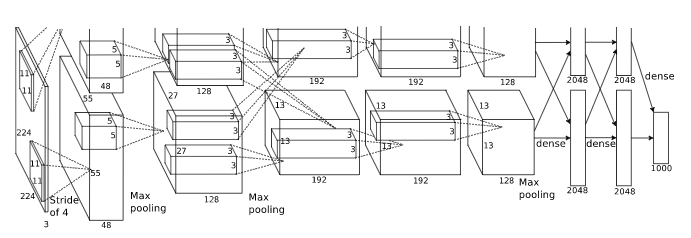*AlexNet architecture for training with 2 GPUs. Source: [A. Krizhevsky and al (2012)](https://papers.nips.cc/paper/4824-imagenet-classification-with-deep-convolutional-neural-networks)*

## Going deeper  
Since the 2012 milestone, researchers have tried to go deeper in the sequences of convolutional layers. In 2014, [K. Simonyan & A. Zisserman (2015)](https://arxiv.org/abs/1409.1556.pdf) released the VGG16 model, composed of sixteen convolutional layers, multiple max-pool layers and tree final fully-connected layers. One of its specificities is to chain multiple convolutional layers with ReLu activation functions creating non-linear transformations. Indeed, introducing non-linearities allow models to learn more complex patterns. Moreover they introduced 3x3 filters for each convolution (as opposed to 11x11 filters for the AlexNet model) and noticed they could recognised the same patterns than larger filters while decreasing the number of parameters to train. These transformations reached 7.3% top-5 score on the 2014 ImageNet challenge reducing by a factor of two the error rate of the AlexNet model.

## Inception modules
This same year, [M. Lin and al (2014)](https://arxiv.org/abs/1312.4400.pdf) have developed the concept of "inception modules". Original convolutional layer uses linear transformations with a non-linear activation function. However, training multiple convolutional layers simultaneously and stack their feature maps linked with a multi-layer perceptron also produces a non-linear transformations. This idea has been exploited by [C. Szegedy and al (2014)](https://arxiv.org/abs/1409.4842) who proposed a deeper network called GoogLeNet (aka Inception V1) with 22 layers using such "inception modules" for a total of over 50 convolution layers. Each module is composed of 1x1, 3x3, 5x5 convolution layers and a 3x3 max-pool layer to increase sparsity in the model and obtain different type of patterns. The produced feature maps are then concatenated and analyzed by the next inception module. The GoogLeNet model has a 6.7% error rate over the 2014 ImageNet challenge which is somewhat lower than the VGG16 but astonishingly smaller than its VGG16 counterpart (55MB vs 490MB). This gap is mainly due to the presence of the three large fully-connected layers in the VGG architecture.

**[PAS COMPRIS] A more complex module using 1x1 convolution before the 3x3 and 5x5 ones, it realizes linear projections (seen as linear rectifications) and dimension reductions while parameters learnt focus the patterns over the feature maps.**

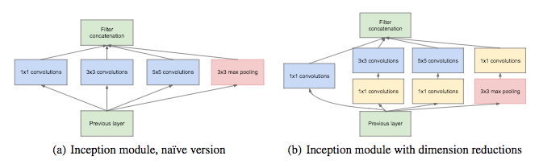*Inception module. Source: [C. Szegedy and al (2014)](https://arxiv.org/abs/1409.4842)*

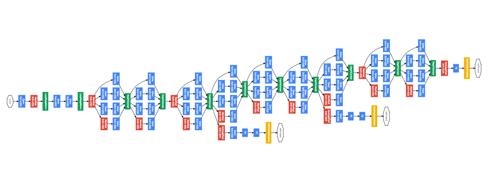*GoogLeNet architecture. Source: [C. Szegedy and al (2014)](https://arxiv.org/abs/1409.4842)*

In 2015, [C. Szegedy and al (2015)](https://arxiv.org/abs/1512.00567) developed  the Inception V2 model, mostly inspired by the first version. The authors have however changed the 5x5 filter in the inception modules by two 3x3 filters, a 3x3 convolution and a 3x1 fully-connected slided over the first one. This method called convolution factorization decreases the number of parameters in each inception module, thus reducing the computational cost. This model reached a top-5 error rate of 5.6% on the 2012 ImageNet challenge.

Going further, [C. Szegedy and al (2015)](https://arxiv.org/abs/1512.00567) have fine-tuned the batch-normalization and used a higher resolution input, the famous Inception V3 model. They reduced the strides of the first two layers and removed a max-pool layer to analyze images with higher precision. They finally reached a top-5 error rate of 3.58% over the 2012 ImageNet challenge.

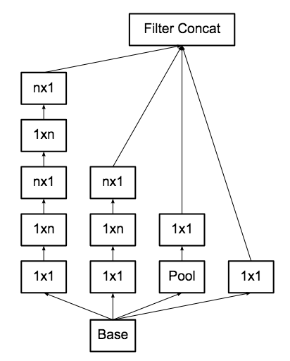*Inception module factorization application replacing 5x5 convolution
by two 3x3 convolutions. Source: [C. Szegedy and al (2015)](https://arxiv.org/abs/1512.00567)*

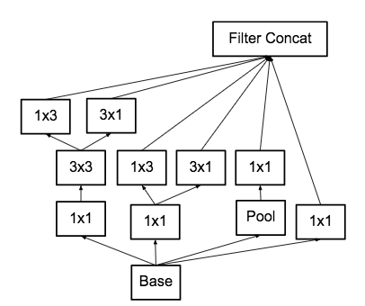*Inception module factorization application replacing 5x5 convolution
by two 3x3 convolutions. Source: [C. Szegedy and al (2015)](https://arxiv.org/abs/1512.00567)*

## Residual learning
The main common trend in convolutional neural network models is their increasing depth. [K. He and al (2015)](http://arxiv.org/abs/1512.03385) noticed however,  that the increasing depth involves a increasing error rate, not due to overfitting but to the difficulties to train and optimize an extreme deep models. "Residual Learning" has been introduced to create a connection
between the output of one or multiple convolutional layers and their
original input with an identity mapping. In other words, the model is
trying to learn a residual function which keeps most of the information
and produces only slight changes. Consequently, patterns from the input image can be learnt in deeper layers is it's not too much transformed yet. Moreover, this method doesn’t add any additional parameter and doesn’t increase the computational complexity of the model. This model, dubbed "ResNet", is composed of 152 convolutional layers with 3x3 filters using residual learning by
block of two layers. Although it got a top-5 error rate of 4.49% over
the 2012 ImageNet challenge (less than the Inception V3), the ResNet
model has won the 2015 challenge with a top-5 error rate of 3.57%. **[HOW IS THIS POSSIBLE??]**

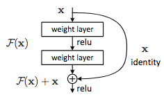*Residual learning block architecture. Source: [K. He and al (2015)](http://arxiv.org/abs/1512.03385)*

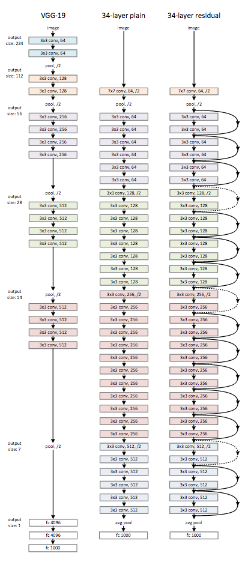*ResNet architecture. Source: [K. He and al (2015)](http://arxiv.org/abs/1512.03385)*

### The Inception-ResNet
One year after the success of the ResNet model, [C. Szegedy and al (2016)](http://arxiv.org/abs/1602.07261) combined inception modules (to increase sparsity) and residual blocks (to learn deeper layers), building residual inception blocks. The inception modules have been improved to fine-tune the layer sizes and to detect more specific patterns. This model also omits batch-normalization on the top of the network with traditional layers to increase the number of inception blocks**[I DONT UNDERSTAND HERE]**. The resulting Inception V4 (Inception-ResNet)[^2] model can be trained faster and outperforms all other models over the 2012 ImageNet challenge with a top-5 error rate of 3.08%.

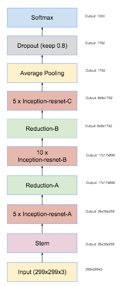*Inception-ResNet architecture using complex modules. Source: [C. Szegedy and al (2016)](http://arxiv.org/abs/1602.07261)*

Every day, new blocks to improve performance and speed up training
are proposed. For example, the "Squeeze-and-Excitation" module
[(J. Hu, 2017)](https://arxiv.org/abs/1709.01507) uses an architecture combining multiple fully-connected layers, inception modules and residual blocks. One of its main advantages is the low number of parameters (thus reducing computational cost) while retaining a top-5 error rate of 2.25%, promoting him winner of the 2017 ImageNet challenge.

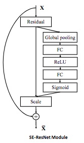*SE-ResNet module. Source: [J. Hu (2017)](https://arxiv.org/abs/1709.01507)*

## Conclusion
This post described the milestones reached in deep learning for the image classification problem, and more specifically around the ImageNet challenge. However, it is not an exhaustive list of all the existing models. New ones appear every day, as a reminder that image classification is a very active field of research in computer vision.

Most of them however requires, with a size of hundred of megabytes, a significant computational cost due to the large number of operation involved, even in inference mode. This constitutes a real matter of concern for deep learning models embedded on mobile devices. Optimization of architectures and weights storage in inference also constitutes an active field of research, which will be addressed in an upcoming post.

[^1]: Synonym sets

[^2]: In [C. Szegedy and al (2016)](http://arxiv.org/abs/1602.07261) is developed a pure Inception V4 without residual block and an Inception-ResNet V2 model which uses inception modules and residual blocks. What we call Inception V4 here is the actual Inception-ResNet V2 providing the best performances.
