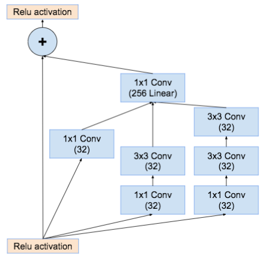
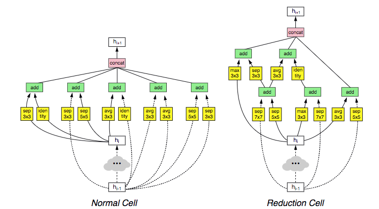
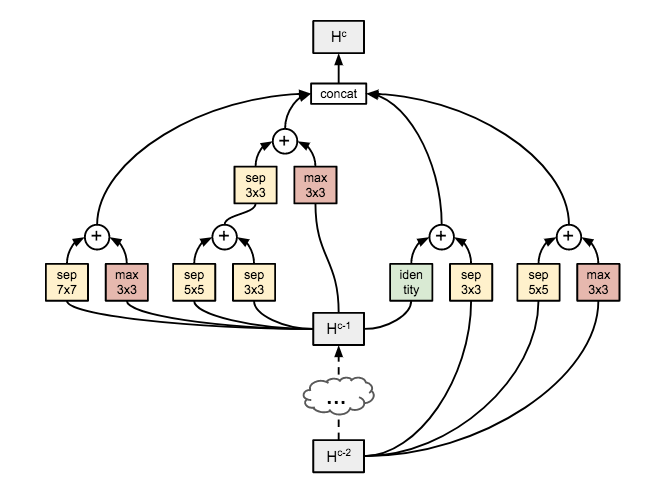

# Review of Deep Learning Algorithms for Image Classification

## Why do we need image classification?
In the previous post, we praised the advantages of embedded deep learning algorithms into mobile phones. While the applications are numerous, we will focus on computer vision algorithms, the heart of Zyl. One of the most popular task of such algorithms is image classification, ie telling which object appears on a picture. Indeed mobile phones host a diverse and rich photo gallery which then become a personal database difficult to manage especially to recover specific events. Users should be able to have a memory in their mind and find the associated images in the most efficient way. A first intuitive approach would be to type in a word corresponding to the content of the image. Searching images with words is, from a machine learning point of view, a classification problem with a high number of classes.

The purpose of this post is to provide a review of the state-of-the-art of image classification algorithms based on the most popular labelled dataset, ImageNet. We will describe some of the innovative architectures which lead to significant improvements.
Note that researchers test their algorithms using different datasets (a new ImageNet dataset is released as a new challenge with different images each year). Thus the cited accuracies cannot be directly compared *per se*.

## The ImageNet challenge
The ImageNet database is the outcome of a collaboration between Stanford University and Princeton University, and has become a reference in the field of computer vision. It contains around fourteen millions images originally labeled with Synsets[^1] of the WordNet lexicon tree. The original challenge
consisted in a simple classification task, each image belonging to a single
category among one thousand, from specific breed of dog to precise
type of food. Although the original challenge is still on-going, it has further evolved to a multi-classification task with bounding boxes around each individual object. This second challenge will not be covered in this post.

*Example of image in ImageNet2012 dataset: Carbonara. Source: [ImageNet](www.image-net.org/)*

*Example of image in ImageNet2012 dataset: English Foxhound. Source: [ImageNet](www.image-net.org/)*

## The advent of deep learning
The ImageNet challenge has been traditionally tackled with image analysis algorithms such as SIFT with mitigated results until the late 90s. However, a gap in performance has been brought by using neural networks. Inspired by [Y. Lecun et al. (1998)](http://yann.lecun.com/exdb/publis/pdf/lecun-01a.pdf), the first deep learning model published by [A. Krizhevsky et al. (2012)](https://papers.nips.cc/paper/4824-imagenet-classification-with-deep-convolutional-neural-networks) drew attention to the public by getting a top-5 error rate of 15.3% outperforming the previous best one with an accuracy of 26.2% using a SIFT model. This famous model, the so-called "AlexNet" is what can be considered today as a simple architecture with five consecutive convolutional filters, max-pool layers and three fully-connected layers.

*LeNet-5 architecture for digit recognition. Source: [Y. Lecun et al. (1998)](http://yann.lecun.com/exdb/publis/pdf/lecun-01a.pdf)*

*AlexNet architecture for training with 2 GPUs. Source: [A. Krizhevsky et al. (2012)](https://papers.nips.cc/paper/4824-imagenet-classification-with-deep-convolutional-neural-networks)*

## Going deeper  
Since the 2012 milestone, researchers have tried to go deeper in the sequences of convolutional layers. In 2014, [K. Simonyan & A. Zisserman (2015)](https://arxiv.org/abs/1409.1556.pdf) released the VGG16 model, composed of sixteen convolutional layers, multiple max-pool layers and three final fully-connected layers. One of its specificities is to chain multiple convolutional layers with ReLU activation functions creating nonlinear transformations. Indeed, introducing nonlinearities allow models to learn more complex patterns. Moreover they introduced 3x3 filters for each convolution (as opposed to 11x11 filters for the AlexNet model) and noticed they could recognized the same patterns than larger filters while decreasing the number of parameters to train. These transformations reached 7.3% top-5 score on the 2014 ImageNet challenge reducing by a factor of two the error rate of the AlexNet model.

## Inception modules
This same year, [M. Lin et al. (2014)](https://arxiv.org/abs/1312.4400.pdf) have developed the concept of "inception modules". Original convolutional layer uses linear transformations with a nonlinear activation function. However, training multiple convolutional layers simultaneously and stack their feature maps linked with a multi-layer perceptron also produces a nonlinear transformation. This idea has been exploited by [C. Szegedy et al. (2014)](https://arxiv.org/abs/1409.4842) who proposed a deeper network called GoogLeNet (aka Inception V1) with 22 layers using such "inception modules" for a total of over 50 convolution layers. Each module is composed of 1x1, 3x3, 5x5 convolution layers and a 3x3 max-pool layer to increase sparsity in the model and obtain different type of patterns. The produced feature maps are then concatenated and analyzed by the next inception module. The GoogLeNet model has a 6.7% error rate over the 2014 ImageNet challenge which is somewhat lower than the VGG16 but astonishingly smaller (55MB vs 490MB). This gap is mainly due to the presence of the three large fully-connected layers in the VGG architecture.

*Inception modules. Source: [C. Szegedy et al. (2014)](https://arxiv.org/abs/1409.4842)*

*GoogLeNet architecture. Source: [C. Szegedy et al. (2014)](https://arxiv.org/abs/1409.4842)*

In 2015, [C. Szegedy et al. (2015)](https://arxiv.org/abs/1512.00567) developed  the Inception V2 model, mostly inspired by the first version. The authors have however changed the 5x5 filter in the inception modules by two 3x3 filters, a 3x3 convolution and a 3x1 fully-connected slided over the first one. This method called convolution factorization decreases the number of parameters in each inception module, thus reducing the computational cost. This model reached a top-5 error rate of 5.6% on the 2012 ImageNet challenge.

Going further, [C. Szegedy et al. (2015)](https://arxiv.org/abs/1512.00567) have fine-tuned the batch-normalization and used a higher resolution input, the famous Inception V3 model. They reduced the strides of the first two layers and removed a max-pool layer to analyze images with higher precision. They finally reached a top-5 error rate of 3.58% over the 2012 ImageNet challenge.

*Inception module factorization after a nxn convolution. Source: [C. Szegedy et al. (2015)](https://arxiv.org/abs/1512.00567)*

*Inception module factorization application replacing 5x5 convolution
by two 3x3 convolutions. Source: [C. Szegedy et al. (2015)](https://arxiv.org/abs/1512.00567)*

## Residual learning
The main common trend in convolutional neural network models is their increasing depth. [K. He et al. (2015)](http://arxiv.org/abs/1512.03385) noticed however,  that the increasing depth involves an increasing error rate, not due to overfitting but to the difficulties to train and optimize an extremely deep models. "Residual Learning" has been introduced to create a connection
between the output of one or multiple convolutional layers and their
original input with an identity mapping. In other words, the model is
trying to learn a residual function which keeps most of the information
and produces only slight changes. Consequently, patterns from the input image can be learnt in deeper layers. Moreover, this method doesn’t add any additional parameter and doesn’t increase the computational complexity of the model. This model, dubbed "ResNet", is composed of 152 convolutional layers with 3x3 filters using residual learning by
block of two layers. Although it got a top-5 error rate of 4.49% over
the 2012 ImageNet challenge (less than the Inception V3), the ResNet
model has won the 2015 challenge with a top-5 error rate of 3.57%.

*Residual learning block architecture. Source: [K. He et al. (2015)](http://arxiv.org/abs/1512.03385)*

*ResNet architecture. Source: [K. He et al. (2015)](http://arxiv.org/abs/1512.03385)*

### The Inception-ResNet
One year after the success of the ResNet model, [C. Szegedy et al. (2016)](http://arxiv.org/abs/1602.07261) combined inception modules (to increase sparsity) and residual blocks (to learn deeper layers), building residual inception blocks. The inception modules have been improved to fine-tune the layer sizes and to detect more specific patterns. This model doesn't use batch-normalization before the first traditional layers of the network to increase even more the number of inception blocks. The resulting Inception V4 (Inception-ResNet)[^2] model can be trained faster and outperforms all other models over the 2012 ImageNet challenge with a top-5 error rate of 3.08%.

*Architecture of an Inception-resnet-A module. Source: [C. Szegedy et al. (2016)](http://arxiv.org/abs/1602.07261)*

*Inception-ResNet architecture using customized Inception-ResNet modules. Source: [C. Szegedy et al. (2016)](http://arxiv.org/abs/1602.07261)*

### Squeeze and Excitation
Every day, new blocks to improve performance and speed up training
are proposed.
For example, the "Squeeze-and-Excitation" module
[(J. Hu, 2017)](https://arxiv.org/abs/1709.01507) uses an architecture combining multiple fully-connected layers, inception modules and residual blocks. One of its main advantages is the low number of parameters (thus reducing computational cost) while retaining a top-5 error rate of 2.25%, promoting him winner of the 2017 ImageNet challenge.

*Squeeze-Excitation-ResNet module. Source: [J. Hu (2017)](https://arxiv.org/abs/1709.01507)*

### Neural Architecture Search
Google Brain researchers [(B. Zoph and Q.V. Le, 2017)](https://arxiv.org/abs/1611.01578) have released a new concept called Neural Architecture Search (NAS). Basically, it is used as a cell in a Recurrent Neural Network to learn its own architecture using reinforcement learning. For a given range of operations and hyperparameters, multiple sequences are realized to maximize the accuracy as a signal reward for a given dataset. The objective is to learn the best sequence of operations (given a maximal depth) to get an optimized architecture. A CNN architecture learnt with NAS have reached the state-of-the-art test error rate on the CIFAR-10 dataset.

Using this previous work, [B. Zoph et al. (2017)](https://arxiv.org/abs/1707.07012) have created a model with an architecture block learnt using NAS on the CIFRA-10 dataset to perform the ImageNet challenge. These blocks are duplicated and stacked with their own parameters to create the "NASNet" model. The ImageNet dataset is too large to be used for the NAS method but the authors have succeeded to create lighter and speeder block architectures than [C. Szegedy et al. (2016)](http://arxiv.org/abs/1602.07261). The parameters of the NASNet model are trained using the ImageNet. The model achieved a top-5 error rate of 3.8% over the ImageNet 2012 challenge. A smaller version of less than 50MB is also released with a lower error rate than any other equivalently-sized model.

*Architecture of the best convolutional modules learnt with NAS computing the next hidden state using the past one as input. Left: the Normal Cell is the module creating the feature maps. Right: the Reduction Cell is the module reducing the size of the feature maps by a factor of two (it replaces max-pooling layers). Source: [B. Zoph et al. (2017)](https://arxiv.org/abs/1707.07012)*

### Progressive Neural Architecture Search

[C. Liu et al.(2017)](https://arxiv.org/abs/1712.00559) have recently released a method called Progressive Neural Architecture Search (PNAS) to reduce the search space of the algorithm of [B. Zoph et al. (2017)](https://arxiv.org/abs/1707.07012) while keeping competitive results. 

Inspired from the previous work, they have reduced the number of available functions and the combination operators. They have removed the Reinforcement Learning part to create a progressive search. They first start by construct all the possible simple structures with a single function. Each one of them is stacked with an operator to another structure and a learnt function predicts their score to quantify the profitability of learning it. These scores are ordered and the K best ones are selected to be stacked with another structure. The process is iterative until the maximum number of block is reached.

The PNAS model have achieved the same performances than the NAS model developed by  [B. Zoph et al. (2017)](https://arxiv.org/abs/1707.07012) while reducing by factor 5 the training time. This method is promising for deep learning because new intuitive architectures are difficult to find by for researchers.

*Cell structure of the best PNAS model. Source: [C. Liu et al.(2017)](https://arxiv.org/abs/1712.00559)*

## Conclusion
This post described the milestones reached in deep learning for the image classification problem, and more specifically about the ImageNet challenge. However, it is not an exhaustive list of all the existing models. New ones appear every day, as a reminder that image classification is a very active field of research in computer vision.

Caption: Overview of the top-5 error rates on the 2012, 2014, 2015 and 2017 ImageNet challenges.

|Model|ImageNet 2012|ImageNet 2014|ImageNet 2015|ImageNet 2017|
|-----|-------------|-------------|-------------|-------------|
|AlexNet|15.3%|x|x|x|
|VGG16|x|7.3%|x|x|
|GoogLeNet (Inception V1)|x|6.7%|x|x|
|Inception V2|5.6%|x|x|x|
|Inception V3|3.58%|x|x|x|
|ResNet|4.49%|x|3.57%|x|
|Inception-ResNet (Inception V4)|3.08%|x|x|x|
|SE-ResNet|x|x|x|2.25%|
|NASNet|3.8%|x|x|x|

Most of them however requires, with a size of hundred of megabytes, a significant computational cost due to the large number of operation involved, even in inference mode. This constitutes a real matter of concern for deep learning models embedded on mobile devices. Optimization of architectures and weights storage in inference also constitutes an active field of research, which will be addressed in a future post.

[^1]: Synonym sets

[^2]: [C. Szegedy et al. (2016)](http://arxiv.org/abs/1602.07261) developed a pure (i.e. without residual block) Inception V4 and an Inception-ResNet V2 model which uses inception modules and residual blocks. The aforementioned Inception V4 is the Inception-ResNet V2 providing the best performances.

Tags: review, CNN, difficult
