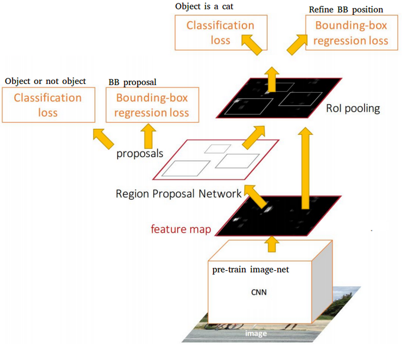

# Article 3: multiclassification

To define: PASCAL VOC, COCO, mAP score, IoU

## Region-based Convolutional Network (R-CNN)

The selective search method developed by [J.R.R. Uijlings and al. (2012)](http://www.huppelen.nl/publications/selectiveSearchDraft.pdf) is an alternative to exhausting seach in an image to capture object location. It initializes small regions in an image and merges them with a hierarchical grouping so that the final group is a box on the entire image. The detected regions are merged according to variety of color spaces and similarity metrics. The output is a few number of region proposals which could contain an object.

*Selective Search application, top: visualisation of the segmention results of the algorithm, down: visualisation of the region proposals of the algorithm. Source: [J.R.R. Uijlings and al. (2012)](http://www.huppelen.nl/publications/selectiveSearchDraft.pdf)*

The Region-based Convolutional Network (R-CNN) model developed by [R. Girshick and al. (2014)](http://islab.ulsan.ac.kr/files/announcement/513/rcnn_pami.pdf) combines the selective search method to detect region proposals and deep learning to find out the object in these regions. 
Each region proposal is resized to match the input of a CNN and it extracts a 4096-dimension vector of features. The features vector is feeded into multiple classifiers to produce probabilities to bellong to each class. Each one of these classes has a SVM classifier trained to infer a probability to detect this object for a given vector of features. This vector also feeds a linear regressor to adapt the shapes of the bounding boxe for a region proposal and thus reduce localization errors.

The CNN model described by the authors is trained on the 2012 ImageNet dataset of the original challenge of image classification. It is fine-tuned using the warped region proposal with IoU (MATH?) >= 0.5 with the ground-truth boxes. Two versions are produced, one version is using the 2012 PASCAL VOC dataset and the other the 2013 ImageNet dataset with bounding boxes. The SVM classifiers are also trained for each class of each dataset.

The best R-CNNs models have achieved a 62.4% mAP score over the VOC 2012 test dataset (22.0% increase w.r.t. the second best result on the leader board) and a 31.4% mAP score over the 2013 ImageNet dataset (7.1% increase w.r.t. the second best result on the leader board).

*Region-based Convolution Network (R-CNN). Each region proposal feeds a CNN to extract a features vector, possible objects are detected using multiple SVM classifiers and a linear regressor modify the coordinates of the bounding box. Source: [J. Xu's Blog](https://towardsdatascience.com/deep-learning-for-object-detection-a-comprehensive-review-73930816d8d9)*

## Fast Region-based Convolutional Network (Fast R-CNN)

The purpose of the Fast Region-based Convolutional Network (Fast R-CNN) developped by [R. Girshick (2015)](https://arxiv.org/pdf/1504.08083.pdf) is to reduce the time consumption related to the high number of models necessary to analyse all region proposals. The model describes by the author is called "Fast" R-CNN because the network training is 9 times faster then the basique R-CNN and 213 times faster for inference.

A main CNN with multiple convolutional layers is taking the entire image as input instead of using a CNN for each region proposals (R-CNN). Region of Interests (RoIs) are detected on the produced features maps with the selective search method. Formally, the features maps size is reduced using a RoI pooling layer to get valid Region of Interests by fixing heigh and width as hyper-parameters. Each RoI layer produced feeds fully-connected layers[^1] creating a features vector. The vector is used to predict the observed object with a softmax classfier and to adapt bounding box localizations with a linear regressor. 

The best Fast R-CNNs have reached mAp scores of 70.0% for the 2007 PASCAL VOC test dataset, 68.8% for the 2010 PASCAL VOC test dataset and 68.4% for the 2012 PASCAL VOC test dataset.

*The entire image feeds a CNN model to detect RoI on the features maps. Each region is separated using a RoI pooling layer and it feeds fully-connected layers. This vector is used by a softmax classifier to detect the object and by a linear regressor to modify the coordinates of the bounding box. Source: [J. Xu's Blog](https://towardsdatascience.com/deep-learning-for-object-detection-a-comprehensive-review-73930816d8d9)*

## Faster Region-based Convolutional Network (Faster R-CNN)

Region proposals detected with the selective search method was still necessary in the previous model and it is computationaly expensive. [S. Ren and al. (2016)](https://arxiv.org/pdf/1506.01497.pdf) have introduced Region Proposal Network (RPN) to directly generate region proposals, predict bounding boxes and detect objects. The Faster Region-based Convolutional Network (Faster R-CNN) is a combination between the RPN and the Fast R-CNN model.

A CNN model takes as input the entire image and produces features maps. A window of size 3x3 slides all the features maps and it outputs a features vector linked to two fully-connected layers, one for box-regression and one for box-classification. Multiple region proposals are predicted by the fully-connected layers. A maximum of k regions is fixed thus the output of the box-regression layer has a size of 4k (coordinates of the boxes, their height and width) and the output of the box-classification layer a size of 2k ("objectness" scores to detect an object or not in the box). The k region proposals detected by the slicing window are called anchors.

*Detecting the anchor boxes for a single 3x3 window. Source: [S. Ren and al. (2016)](https://arxiv.org/pdf/1506.01497.pdf)*

When the anchor boxes are detected, they are selected by applying a threshold over the  "objectness" score to keep only the relevant boxes. These anchor boxes and the features maps computed by the inital CNN model feeds a Fast R-CNN model.

Faster R-CNN uses RPN to avoid the selective search method, it accelerates the training and testing processes and improve the performances. The RPN uses a pre-trained model over the ImageNet dataset for classification and it is fine-tuned on the PASCAL VOC dataset. Then the generated region proposals with anchor boxes are used to train the Fast R-CNN, this process is iterative. 

The best Faster R-CNNs have obtained mAP scores of  78.8% over the 2007 PASCAL VOC test dataset and 75.9% over the 2012 PASCAL VOC test datset. They have been trained with PASCAL VOC and COCO datasets. One of these models [^2] is 34 times faster than the Fast R-CNN using the selective search method.

*The entire image feeds a CNN model to produce anchor boxes as region proposals with a confience to contain an object. A Fast R-CNN is used taking as inputs the features maps and the region proposals. For each box, it produces probabilities to detect each object and correction over the location of the box. Source: [J. Xu's Blog](https://towardsdatascience.com/deep-learning-for-object-detection-a-comprehensive-review-73930816d8d9)*

## Region-based Fully Convolutional Network (R-FCN)
Fast and Faster R-CNN methodologies consist in detecting region proposals and recognize an object in each region. The Region-based Fully Convolutional Network (R-FCN) released by [J. Dai and al. (2016)](https://arxiv.org/pdf/1605.06409.pdf) is a model with fully connected convolutional layers allowing complete backpropagation for training and fastest inferences. The authors have merged the two basic steps in a single model to take into account simultaneously the object detection (location invariance) and its position (location variance).

A 101-layers [ResNet](https://arxiv.org/pdf/1512.03385.pdf) model takes the initial image as input. The last layer outputs features maps, each one is specialized in the dectection of a category at a precise location. For example, one features map is specialized in the detection of a cat at the top-right of the image, another one is specialized in the detection of a banana at the bottom-left of the image and so on. These features maps are called **position-sensitive score maps** because they take into account the spatial localisation of a particular object.
A fully-connected layer associated to the position-sensitive score maps creates a **score bank** of size k^2(C+1), with k*k the shape of the spatial grid describing relative positions and C the the number of object categories.

A Region Proposal Network (RPN) layer is computed to detect the Region of Interest (RoI) using features maps of ResNet model as input. The selected RoIs are reduced in a shape of k*k for each features map, each one of these region is related to a score in the score bank. A kxk matrix grouping a specific part of each features maps for a given local region is aggregated to have a score for each class using the score bank. The final vector of the aggregate scores is used as input of a softmax to compute the probabilities to detect an object.
Thus, a given kxk region in the features maps is linked to the object the most likely to be detected.

*The input image feeds a ResNet model to produce features maps. A RPN model detects the Region of Interests and a score is computed for each region to determine the most likely object if there is one. Source: [J. Xu's Blog](https://towardsdatascience.com/deep-learning-for-object-detection-a-comprehensive-review-73930816d8d9)*

The concept is difficult to visualize, [J. Dai and al. (2016)](https://arxiv.org/pdf/1605.06409.pdf) have detailed an example displayed bellow. The figures shows the reaction of a R-FCN model specified in the baby detection.
For a RoI in the center of the image in the Figure 3, the subregions in the features maps are specific to the patterns associated to a baby. Thus they vote for "yes, there is a baby at this location". In the Figure 4, the RoI is shifted to the right and it is no longer center on the baby. The subregions in the features maps are not agree on the baby detection, thus they vote "no, there is no baby at this location".

*Source: [J. Xu's Blog](https://towardsdatascience.com/deep-learning-for-object-detection-a-comprehensive-review-73930816d8d9)*

The best R-FCNs have reached mAP scores of 83.6% for the 2007 PASCAL VOC test dataset and 82.0%, they have been trained with the 2007, 2012 PASCAL VOC datasets and the COCO dataset. Over the developer test dataset of the 2015 COCO challenge, they have had a score of 53.2% for an IoU = 0.5 and a score of 31.5% for the official mAP metric. The authors noticed that the R-FCN is 2.5-20 times faster than the Faster R-CNN conterpart.

## You Only Look Once (YOLO)
The YOLO model developped by [J. Redmon and al. (2016)](https://arxiv.org/pdf/1506.02640.pdf) directely predict bounding boxes and class probabilities with a single network and a single evaluation. The simplicity of the YOLO model allow a high frequence of computation to realize real-time predictions.

Initially, the model takes an image as input, it divides it into an SxS grid and each cell associated to a grid predicts B bounding boxes and their confidence scores. This confidence is simply the probability to detect the object multiply by the IoU between the predicted and the ground truth boxes.

*Example of application. The input image is divided into an SxS grid, B bounding boxes are predicted (regression) and a class is predicted among C classes (classification) over the most confident ones. Source: [J. Redmon and al. (2016)](https://arxiv.org/pdf/1506.02640.pdf)*

The CNN used is inspired by the [GoogLeNet](https://arxiv.org/pdf/1409.4842.pdf) model introducing the inception modules. The network has 24 convolutional layers followed by 2 fully-connected layers. Reduction layers with 1x1 filters [^3] followed by 3x3 convolutional layers replace the initial inception modules. The Fast YOLO model is a lighter version with only 9 convolutional layers and fewer number of filters. Most of the convolutional layers are trained using the ImageNet dataset with classification. Four convolutional layers followed by two fully-connected layers following the previous network, these layers are trained with the 2007 and 2012 PASCAL VOC datasets. 

The final layer outputs a SxSx(C+B*5) tensor corresponding to the predictions for each cell of the grid. C is the number of estimated probabilities for each class. B is the fixed number of bouding boxes each one related to 4 coordinates (coordinates of the center of the box, width and height) and a confidence value.

With the previous models, the predicted bounding boxes were often containing an object. The YOLO model predict a high number of bounding boxes on the entire image thus there are a lot of bounding boxes without any object. The Non-Maximum Suppression (NMS) method is applied at the end of the network. It consists in grouping highly-overlapping bounding boxes into a single one by keeping the boxe with the higher confidence value. The authors noticed that there are still few false positive detected.

*YOLO architecture: it is composed of 24 convolutional layers and 2 fully-connected layers. Source: [J. Redmon and al. (2016)](https://arxiv.org/pdf/1506.02640.pdf)*

The YOLO model has a 63.7% mAP score over the 2007 PASCAL VOC dataset and a 57.9% mAP score over the 2012 PASCAL VOC dataset. The Fast YOLO model has lower scores but they have both real time performances.

Caption: Real Time Systems on PASCAL VOC 2007. Comparaison of speeds and performances for models trained with the 2007 and 2012 PASCAL VOC datasets. The published resultsa correspond to the implementations of [J. Redmon and al. (2016)](https://arxiv.org/pdf/1506.02640.pdf).

|Model|mAP|FPS|Real Time speed|
|-------|-------|-------|-------|
|Fast YOLO|52.7|**155**|Yes|
|YOLO|**63.4**|45|Yes|
|YOLO VGG-16|66.4|21|No|
|Fast R-CNN|70.0|0.5|No|
|Faster R-CNN VGG-16|73.2|7|No|
|Faster R-CNN ZF|62.1|18|No|

## Single-Shot Detector (SSD)

As the YOLO model, [W. Liu and al. (2016)](https://arxiv.org/pdf/1512.02325.pdf) have developped a Single-Shot Detector (SSD) to predict all at once the bounding boxes and the class probabilities with a particular CNN architecture.

The model takes an image as input and it is used through multiple convolutional layers with different size of filter (10x10, 5x5 and 3x3). Features maps from convolutional layers at different position of the network are used to predict the bounding boxes. They are processed by a specific convolutional layers with 3x3 filters called extra feature layers to produce a set of bounding boxes similar to the anchor boxes of the Fast R-CNN. 

*Comparison between the SSD and the YOLO architectures. The SSD model uses extra feature layers from different features maps of the network in order to increase the number of relevant bounding boxes. Source: [W. Liu and al. (2016)](https://arxiv.org/pdf/1512.02325.pdf)*

The detected boxes have 4 parameters: the coordinates of the center of the box, the width and the height. The model predicts a variation of the coordinates of the center of the box to optimize the spatial location. At the same time, it produces a vector of probabilities corresponding to the confience over each class of object.

*SSD Framework. (a) The model takes an image and its ground truth bounding boxes. Small sets of boxes with different aspect ratios are fixed by the different features map ((b) and (c)). During training, the boxes localization are modified to best match the ground truth.*

The Non-Maximum Suppression method is also used at the end of the SSD model to keep the most relevant bounding boxes. The Hard Negative Mining (HNM) is then used because negative boxes are still predicted. It consists in selecting only a subpart of negative boxes during the training. The boxes are ordered by confidence and the top is selected depending on the ratio between the negative and the positive which is at most 1/3.

[W. Liu and al. (2016)](https://arxiv.org/pdf/1512.02325.pdf) distinguish the SSD300 model (the architecture is detailed on the figure above) and the SSD512 model which is the SSD300 with an extra convolutional layer for prediction to improve performances. The best SSDs models are trained with the 2007, 2012 PASCAL VOC datasets and the 2015 COCO dataset with data augmentation. They have obtained mAP scores of 83.2% over the 2007 PASCAL VOC test dataset and 82.2% over the 2012 PASCAL VOC test dataset. Over developer test dataset of the 2015 COCO challenge, they have had a score of 48.5% for an IoU = 0.5, 30.3% for an IoU = 0.75 and 31.5% for the official mAP metric.

## YOLO9000 and YOLOv2

[J. Redmon and A. Farhadi (2016)](https://arxiv.org/pdf/1612.08242.pdf) have released a new model called YOLO9000 capable of detecting more than 9000 object categories while still runing in real-time. They also provide ameliorations on the initial YOLO model to improve its performances without decreasing its speed.

### YOLOv2
The YOLOv2 model is focused on improving accuracy while still being a fast detector. Batch normalization is added to prevent overfitting without using dropout and higher resolution images are accepted as input.

The final fully-connected layer of the YOLO model predicting the coordinates of the bounding boxes has been removed to use anchor boxes instead in the same way as Faster R-CNN. The input image is reduced to a grid and each cell is containing 5 anchor boxes. The YOLOv2 uses hundreds of anchor boxes by image instead of 98 boxes for the YOLO model. YOLOv2 predicts location coordinates relative to the location of the grid cell (the range is between 0 and 1) and selects the boxes according to their confidence as the SSD model. The number of anchor boxes has been fixed using k-means on the training set of bounding boxes with a particular distance metric.

*Prediction on ImageNet vs WordTree. Source: [J. Redmon and A. Farhadi (2016)](https://arxiv.org/pdf/1612.08242.pdf)*

It uses a ResNet-like architecture to stack high and low resolution features maps to detect smaller objects. The "Darknet-19" is composed of 19 convolutional layers with 3x3 and 1x1 filters, groups of convolutional layers are folowed by maxpooling layers to reduce the output dimension. A final 1x1 convolutional layer outputs 5 boxes per cell of the grid with 5 coordinates and 20 probabilities each (the 20 classes of the PASCAL VOC  dataset).

*YOLOv2 architecture. Source: [J. Redmon and A. Farhadi (2016)](https://arxiv.org/pdf/1612.08242.pdf)*

The YOLOv2 model trained with the 2007 and 2012 PASCAL VOC dataset has a 78.6% mAP score over the 2007 PASCAL VOC test dataset with a FPS value of 40. The model trained with the 2015 COCO dataset have mAP scores over the developer test of 44.0% for an IoU = 0.5, 19.2% for an IoU = 0.75 and 21.6% for the official mAP metric.

## YOLO9000

The authors have combined the ImageNet dataset with the COCO dataset in order to have a model capable of detect precise objects or animal breed. The ImageNet dataset for classification contains 1000 categories and the 2015 COCO dataset only 80 categories. The ImageNet classes are based on the WordNet lexicon developed by the Princeton University [^4] and it is composed with more than 20 000 words. [J. Redmon and A. Farhadi (2016)](https://arxiv.org/pdf/1612.08242.pdf) detail a method with the tree version of the WordNet. A softmax is applied on a group of labels with the same hyponym when the model predicts on an image. Thus the final probability associated to a label is computed with posterior probabilities in the tree. When the authors extend the concept to the entire WordNet lexicon excluding under represented categories, they obtain more than 9 000 categories.

A combinaison between the COCO and the ImageNet datasets is used to train a YOLOv2-like architecture with 3 prior convolution layers instead of 5 to limite the output size. The model is evaluated on the ImageNet dataset for the detection task with around 200 labels. Only 44 labels are shared between the training and the testing dataset so the results are not relevant. It gets a 19.7 mAP score overall the test dataset.

ONE MORE (2017) MASK RCNN pixel lever: https://arxiv.org/abs/1703.06870

[^1]: The entire architecture is inspired from the VGG16 model, thus it has 13 convolutional layers and 3 fully-connected layers.
[^2]: The fastest Faster R-CNN has an architecture inspired by the ZFNet model introduced by [M.D. Zeiler and R. Fergus (2013)](https://arxiv.org/pdf/1311.2901.pdf). The commonly used Faster R-CNN has an architecture similar to the VGG16 model and it is 10 times faster than the Fast R-CNN.
[^3]: It reduces the features space from the previous layers.
[^4]: Details are provided in the previous blog post.