# Deep Learning Model Compression for Image Analysis: Methods and Architectures.

Need photo with object recognition on mobile

In my previous blog posts, I have reviewed well-known and recent deep learning algorithms for [image classification](https://medium.com/comet-app/review-of-deep-learning-algorithms-for-image-classification-5fdbca4a05e2) and [object detection](https://medium.com/comet-app/review-of-deep-learning-algorithms-for-object-detection-c1f3d437b852). At Zyl, we aim at embedding deep learning models directly within user's smartphones to guarantee their privacy. This induces multiple constraints for these models known to be heavy and greedy in energy. Fortunately, they will however be used only for inference[^1]. Nevertheless, the computational cost is high even for inference and requires a lot of energy. This section describes theoretical methods to reduce model size. Size reduction for deep learning models is an active field of research. Unfortunately, while performant, this specific type of machine learning models involves extremely deep and complex architectures ([Simonyan et al. (2014)](http://arxiv.org/abs/1409.1556), [He et al. (2015)](http://arxiv.org/abs/1512.03385), [Szegedy et al. (2016)](http://arxiv.org/abs/1602.07261)). How can we simply transform a deep model into a lighter one without decreasing dramatically its performances ? Moreover, does it exist specialized architectures to build light models while achieving state-of-the-art performances ? Note that researchers test their algorithms using different datasets (a new ImageNet dataset is released as a new challenge with different images each year). Thus the cited accuracies cannot be directly compared *per se*.

## Deep Compression
[Han et al. (2015)](http://arxiv.org/abs/1510.00149) have developed a method called **Deep Compression** to reduce the size of a deep learning model. Their experiments have empirically shown that the deep compression have no significant impact on the performances of the model while reducing its size by a factor from 35 to 49. The pipeline is decomposed into three independent tricks realized consecutively: network pruning, trained quantization and Huffman encoding.

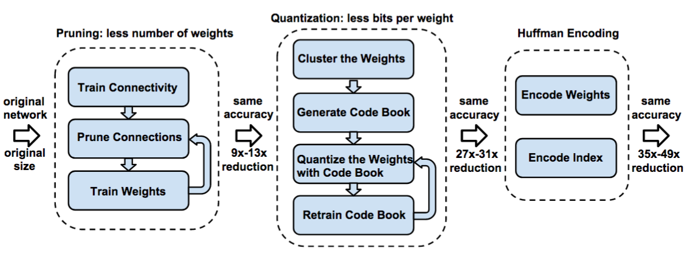*Pipeline of the Deep Compression with the cumulated factors of size reduction. Source: [Han et al. (2015)](http://arxiv.org/abs/1510.00149)*

### Network Pruning
As initiated in [Han et al. (2015)](http://arxiv.org/abs/1510.00149), **network pruning** consists in fine tuning the weights of a pretrained network while keeping only the relevant ones. After training a network using a standard method, the small weights (in absolute value) below a threshold are removed. The original dense network is transformed into a sparse one preserving the most important connections. The model is retrained while fixing the removed weights to 0. The pruning process is applied again until the remaining weights have high values. [Han et al. (2015)](http://arxiv.org/abs/1510.00149) have experimented this method reducing the number of parameters by **9 times and 13 times** for the AlexNet ([Krizhevsky et al. (2012)](http://dl.acm.org/citation.cfm?id=2999134.2999257)) and the VGG16 ([Simonyan et al. (2014)](http://arxiv.org/abs/1409.1556)) models respectively.

### Trained Quantization
As explain in the pipeline of [Han et al. (2015)](http://arxiv.org/abs/1510.00149), the **quantization** method is applied over the weights of the model after its pruning but the two methods can be applied independently. A clustering is realized over the 32-bits weights (floats) and the centroids of each cluster are stored as floats in a "code book". The original weights are replaced with 2-bits units indexes (integers) of the code book corresponding to the centroid of their cluster. Thus multiple weights have the same values. This is called **Weight Sharing** because the model have to store only the common value of multiple weights one time and create links to use them. Like the network pruning method, the quantization is applied as a loop by retraining the network and realizing gradient updates in clusters mentioned above. After the updates, the centroids are stored in 32-bits float to preserve precision. According to [Han et al. (2015)](http://arxiv.org/abs/1510.00149) experiments, the quantization method should be able to reduce the number of weights by **18 times**.

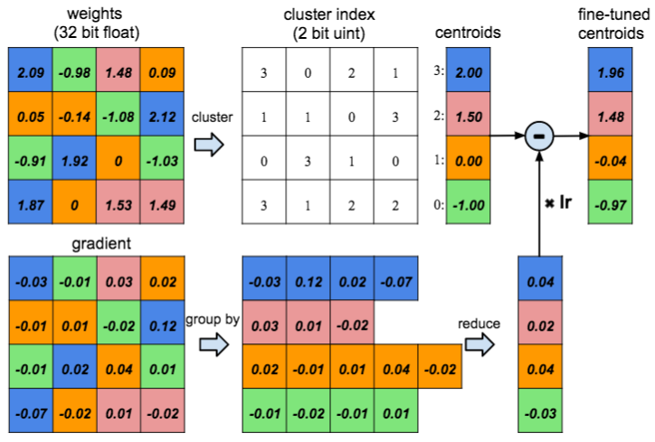*Shared weights (centroids) after clustering from quantization (top) and centroids fine tuning (bottom). Source: [Han et al. (2015)](http://arxiv.org/abs/1510.00149)*

### Huffman Encoding
The previous step provides weights with a discrete distribution from the  indexes of the centroids. The **Huffman code** is a well-known method for lossless data compression. It stores discrete values by occurrence and each value is associated to a common symbol (number, letter, ...). The higher the frequency of a character, the fewer the storage on bits. This method reduces considerably the storage requirements using the sparse matrix indices. According to the experiments of [Han et al. (2015)](http://arxiv.org/abs/1510.00149), the Huffman encoding reduces the global model size by **8 times** to **18 times** while keeping the performances unchanged.

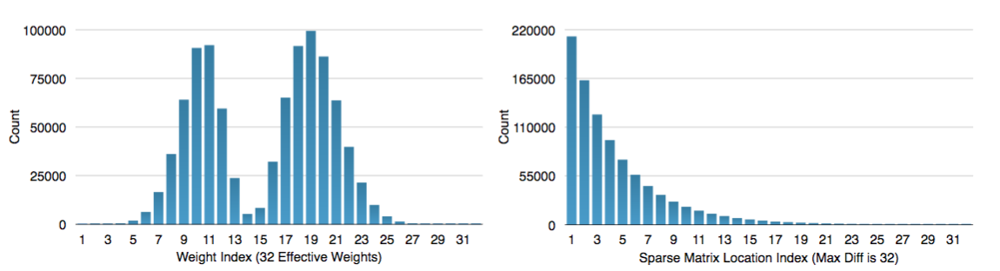*Distribution of the weights after quantization (left) and indices of sparse matrix after Huffman encoding (right). Source: [Han et al. (2015)](http://arxiv.org/abs/1510.00149)*

## Weight Quantization Methods
The quantization method of Deep Compression uses clustering to compute shared values as new weights. Simpler weight quantization methods exist reducing the size of the model and its energy consumption while preserving performances.

### Binarized Neural Networks
[Courbariaux et al. (2016)](https://arxiv.org/abs/1602.02830) have released a method to train Binarized Neural Networks (BNN) replacing weight and activation values by binary values. The authors have binarized them in a deterministic way using a simple [sign function](https://en.wikipedia.org/wiki/Sign_function). They have also detailed a stochastic way using a [hard sigmoid function](https://arxiv.org/pdf/1603.00391.pdf) computing probabilities to assign 1 and -1 values. The deterministic binarization is mostly used while the stochastic one appears sometimes for activations and only at training time.

Gradients are computed with float values because stochastic gradient descent (SGD) algorithm is sensitive to small variations. While the derivative of the sign function is almost 0 everywhere, they use an estimator of its partial derivative. It is based on a dummy variable cancelling high weight or activation values when the function is non differentiable. During the forward pass, the weights of the hidden layers are mapped into a `[-1, 1]` space and quantized using the sign function.

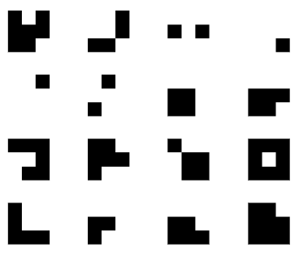*Example of binary weight filter. Source: [Courbariaux et al. (2016)](https://arxiv.org/abs/1602.02830)*

Storing weights as binary values on 2-bits instead of 32-bits dramatically reduces the memory size of the model. Moreover, It decreases the accesses to the memory and arithmetic operations are replaced with bit-wise operations. This way, the computational time for training and testing is reduced as well as the energy consumption useful to embed deep learning models.

### Trained Ternary Quantization
[Zhu et al. (2017)](https://arxiv.org/abs/1612.01064) propose a method called Trained Ternary Quantization (TTQ) reducing weight precision without significantly decreasing the accuracy. This method transforms weights to ternary values each one stored on 2-bits. The weights are quantized into three values specific to each layer: zero to cancel useless connections, a positive value and a negative value.

The authors have been inspired by the work of [Li et al. (2016)](https://arxiv.org/abs/1605.04711). The full-precision weights are scaled into a `[-1, 1]` space. Then the weights are quantized into three values (1, -1 and 0) using a threshold shared between all the layers. Finally, for each layer, the binary values (1 and -1) are trained independently with float precision using gradient descent. The values are stored in a codebook as introduced by [Han et al. (2015)](http://arxiv.org/abs/1510.00149) with indexes learnt during the update of the full-precision weights. During testing, the initial full-precision weights are replaced by the learnt ternary weights values rounded to be stored on 2-bits.

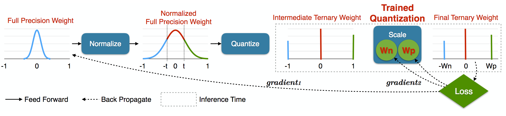*Pipeline of the Trained Ternary Quantization method. Source: [Zhu et al. (2017)](https://arxiv.org/abs/1612.01064)*

According the authors’ implementations, ResNets with TTQ method have reached better performances than the full-precision ones. This method seems to improve generalization of deeper models avoiding overfitting due to high number of parameters. They also trained a customised AlexNet[^2] with TTQ method using the 2012 ImageNet dataset. Slightly better results than the full-precision implementation are obtained and the model size has been reduced by 16 times. The final model have sparse weights reducing time and energy consumptions for inference.

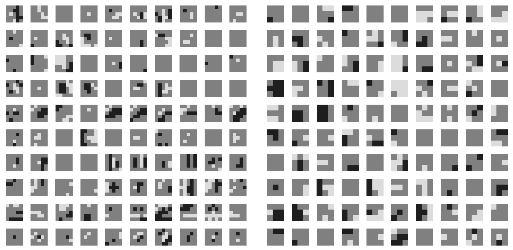*Visualization of kernels from Ternary AlexNet trained from Imagenet. Grey, black and white colors correspond to zero, negative and positive weights respectively. Source: [Zhu et al. (2017)](https://arxiv.org/abs/1612.01064)*

## Specific Model Architectures
Even if methods for model reduction are efficient, architectures of deep neural networks can also be optimized. In this section, recent architectures for small neural networks are developed. This type of models are known to have performances close to the state-of-the-art while having fewer number of parameters to train and infering faster.

### SqueezeNet
[Iandola et al. (2016)](http://arxiv.org/abs/1602.07360) have been inspired from [Szegedy et al. (2014)](http://arxiv.org/abs/1409.4842) and their "inception module" in the GoogLeNet model detailed in my [previous blog post](https://medium.com/comet-app/review-of-deep-learning-algorithms-for-image-classification-5fdbca4a05e2). They have designed a new block called **Fire module** w.r.t. three strategies. The convolutional layers use 1x1 filters instead of several 3x3 filters to reduce the number of parameters by **9 times** for each layer. The Fire module uses fewer filters than classical architecture inducing fewer number of input channels for each layer and thus less parameters. The downsampling using pooling layers is applied lately in the network (close to the output) to increase accuracy without being greedy in the number of parameters used. Formally, the Fire module is a **squeeze** convolutional layer followed by an **expand** convolutional layer. The squeeze layer contains convolutional layers with 1x1 filters with the same input and producing stacked outputs. In the same way, the expand layer contains convolutional layers with 1x1 and 3x3 filters. In a Fire module, the number of filters in the squeeze layer has to be inferior to the total number of filters in the expand layer.

*Example of Fire module. The squeeze layer has three 1x1 conv filters. The expand layer has four 1x1 conv filters and four 3x3 conv filters. Source: [Iandola et al. (2016)](http://arxiv.org/abs/1602.07360)*

The SqueezeNet model has a specific architecture using convolutional layers, pooling layers and Fire modules. A convolutional layer takes an image as input followed by 10 Fire modules and a final convolution layer before the softmax layer. In their experiments, the authors have reached the same performances as the AlexNet model (240 MB) ([Krizhevsky et al. (2012)](http://dl.acm.org/citation.cfm?id=2999134.2999257)) over the ImageNet challenge[^3] while reducing the number of parameters by **50 times** (4.8 MB model). After applying the Deep Compression of [Han et al. (2015)](http://arxiv.org/abs/1510.00149) detailed above, they have also obtained the same performances than the AlexNet with **510 times** less parameters[^4] (0.47 MB model).

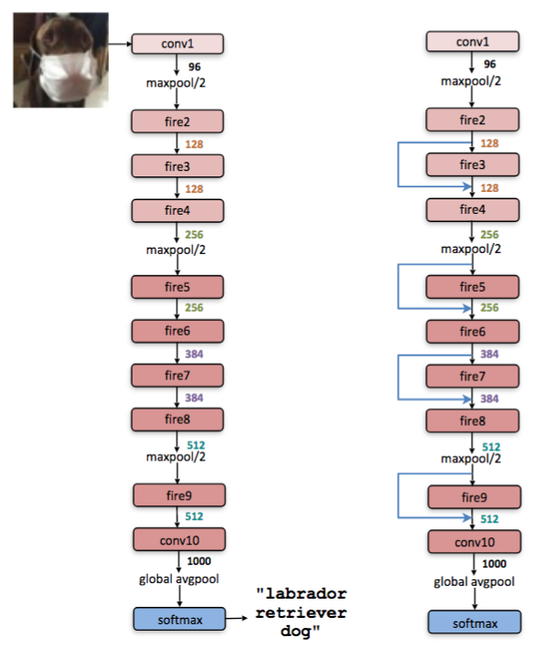*SqueezeNet architectures. Left: classic SqueezeNet architecture (57.5% top-1 accuracy). Right: SqueezeNet with residual connection (60.4% top-1 accuracy). Source: [Iandola et al. (2016)](http://arxiv.org/abs/1602.07360)*

### MobileNet V1
[Howard et al. (2017)](http://arxiv.org/abs/1704.04861) have developed a group of small models called MobileNets for vision applications embedded on mobile. They have built models which are a trade-offs between speed and accuracy to match different purpose. 

The MobileNets architecture is base on the **depth-wise separable** convolution similar to factorized convolution. First, a classic convolution with a filter with a fixed size (3x3 for example) is applied over all the input producing the same number of feature maps, it is the **depth-wise** convolution. Then convolutions with 1x1 filters are used over each feature map, it is the **point-wise** convolution. Factorizing initial convolutions with 1x1 filters reduces dramatically the number of parameters.

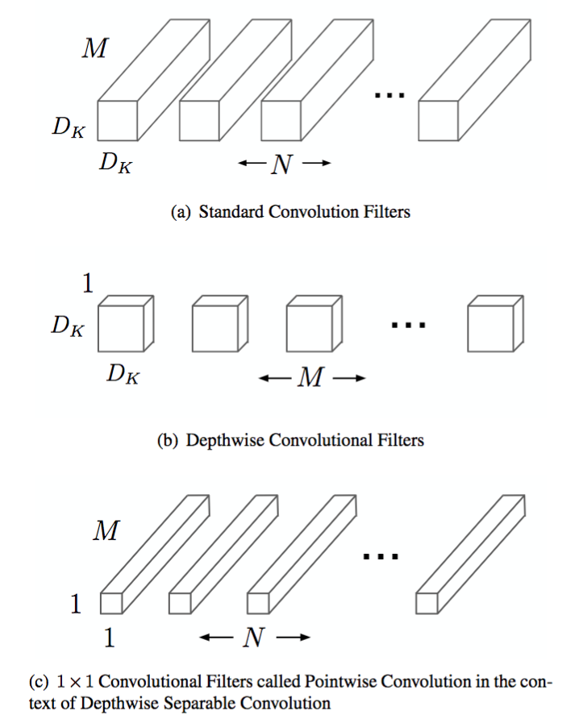*Example of depth-wise separable filter construct with a depth-wise convolution and a 1x1 point-wise convolution where `M` is the depth of the input, `N` the number of feature maps and `Dk` the width and height size of a square feature map. Source: [Howard et al. (2017)](http://arxiv.org/abs/1704.04861)*

The first layer of a MobileNet model is a classic convolutional layer taking an image as input. Then 13 depth-wise separable convolutions (2 layers each) follow each other. An average pooling layer links the feature maps and a fully connected layer with a softmax compute the predictions. All in all, a MobileNet has 28 layers each one followed by a batch normalization and a ReLU nonlinearity except the fully connected.

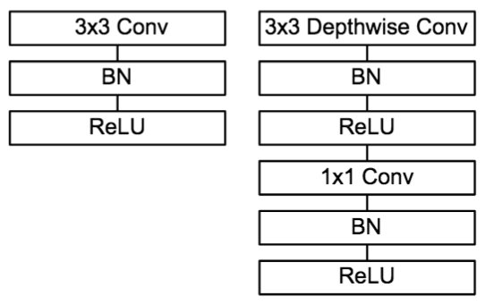*Left: classic convolutional layer with batch normalization and ReLU nonlinearity. Right: depth-wise separable layer with batch normalization and ReLU nonlinearity after each depth-wise and point-wise convolutions. Source: [Howard et al. (2017)](http://arxiv.org/abs/1704.04861)*

MobileNets have variable speed and accuracy depending on two hyper-parameters. The **width multiplier** is a value between 0 and 1 thinning each layer by reducing the number of input and output channels. The **resolution multiplier** is an integer value corresponding to the size of the input image and the internal representations to reduce the computational cost. With the highest values of width and resolution multipliers, the MobileNet model has 4.2 million parameters and [Howard et al. (2017)](http://arxiv.org/abs/1704.04861) have published a top-1 score of 70.6% over the ImageNet challenge. With a width multiplier of 0.25[^5] and a fixed resolution multiplier of 1, the top-1 accuracy is 50.6% with 0.5 million parameters and a model 14 times faster than the previous one. If the width multiplier is fixed and the resolution multiplier is decreased, the number of parameters doesn't change but the models are faster for a slight decrease of the accuracy. A trade-off between these two hyperparameters can be found for different applications and their expectations.

### SEP-Net
[Li et al. (2017)](http://arxiv.org/abs/1706.03912) have focused their work on both side: model compression method and block architecture for small CNNs.

They propose a new approach called **pattern binarization** to binarize specific weights instead of quantize or binarize all of them. Only kxk (`k>1`) filters of convolutional layers used for pattern extraction are binarized. Note that 1x1 filters are used for data transformation and they need to keep information as much as possible. Thus the method is the following: they train their model the usual way, then they binarize the kxk convolutional filters and finally they fine tune the model with binary values for kxk filters and floating points for 1x1 filters using the same dataset.

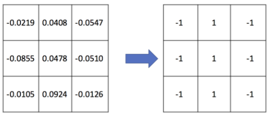*Example of binarized 3x3 convolutional filter. Source: [Li et al. (2017)](http://arxiv.org/abs/1706.03912)*

To design a new block for small CNNs, the authors have developed a **Pattern Residual Block** (PRB). It is composed of a convolutional layer with 1x1 filters and a convolutional layer with 3x3 filters executed in parallel. The feature maps produced by the two layers are summed together. Moreover they use group-wise convolution, splitting the input feature maps of a convolutional features in N (`N=4` in their implementation). The convolutions are applied on each of this subgroup of input data. This method reduces the number of parameter by **N times**.

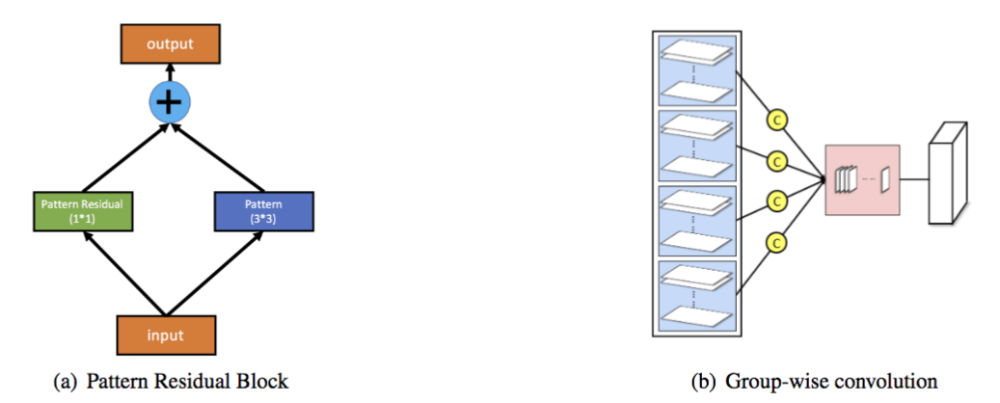*Left: Pattern Residual Block, Right: Group Wise Convolution. Source: [Li et al. (2017)](http://arxiv.org/abs/1706.03912)*

The **SEP-Net module** consists of a convolutional layer with 1x1 filters followed by two PRBs and a final convolutional layer with 1x1 filters. The first layer is a dimension reduction layer while the last one is a dimension recovery layer. This way, a residual connection is constructed between the input of the block and the output of the last layer. The SEP-Net model alternates SEP-Net module and convolutional layer to feed a fully connected layer with a softmax for classification.

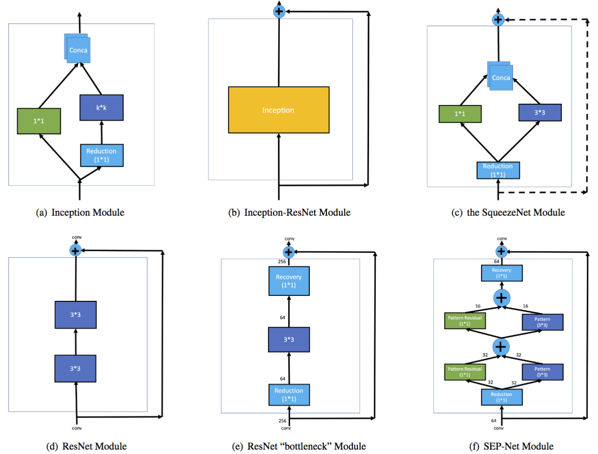*Comparison between well-known architecture of blocks. Source: [Li et al. (2017)](http://arxiv.org/abs/1706.03912)*

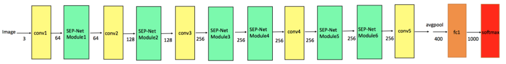*Architecture of the SEP-Net model. Source: [Li et al. (2017)](http://arxiv.org/abs/1706.03912)*

[Li et al. (2017)](http://arxiv.org/abs/1706.03912) have highlighted the relevance of the pattern binarization by reducing the number of parameters of the GoogLeNet model by almost **2 times**. It has only decreased the top-1 accuracy by 3% over the 2012 ImageNet challenge. The SEP-Net model has a top-1 accuracy of 65.8% close to the reduced GoogLeNet for a 5.2 MB model with 1.3 million parameters. According to their implementation, the SqueezeNet model (1.2 million parameters, 4.8 MB) has a top-1 accuracy of 60.4% and the MobileNet (1.3 million parameters, 5.2 MB) has an accuracy of 63.7% which made the SEP-Net the state-of-the-art of small CNNs.

### MobileNet V2
[Sandler et al. (2018)](https://arxiv.org/abs/1801.04381) have recently released a new version of the MobileNet model introduced by [Howard et al. (2017)](http://arxiv.org/abs/1704.04861). In their new architecture block, they have also used depth wise separable convolutions (detailed above) with 3x3 filters. Linear transformations are inserted between convolution blocks called **linear bottleneck** to prevent non-linear transformations to dammage information. This type of layers is a 1x1 convolution reducing the depth of the input feature maps. Another type of layer called **expansion convolution** are used to increased depth of feature maps from a linear bottleneck. In this layer, The ratio between the input and the output depths is called the **expansion ratio**.

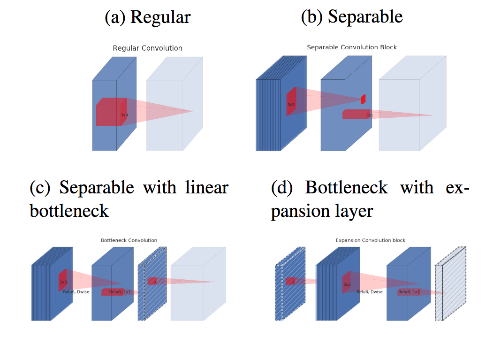*Depth wise separable convolutions with linear bottleneck and expansion layer. The diagonally hatched layers do not contain non-linear transformation and depth of the blocks correspond to the relative number of channels. Source: [Sandler et al. (2018)](https://arxiv.org/abs/1801.04381)*

The linear bottleneck contains an aggregation of informations useful for final computation. Non-linear transformations provided by usual convolutional layers help to find patterns in feature maps.This way, an expansion convolution is applied after a linear bottleneck. The output is followed by depth wise separable convolutions and a new linear botteneck. Thus, the input and the output of this new block have the same dimensions allowing residual connections and thus backpropagation in multiple layers. In this architecture, bottlenecks are connected with each other instead of the large depth layers, that is why the authors called it "**Inverted residual block**".

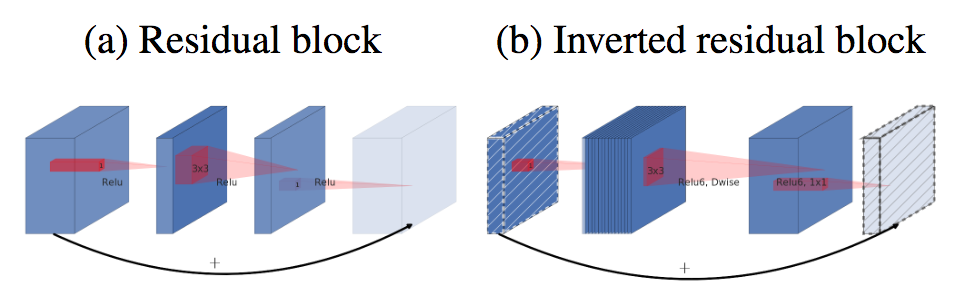*Comparison between residual and inversted residual blocks. The diagonally hatched layers do not contain non-linear transformation and depth of the blocks correspond to the relative number of channels. Source: [Sandler et al. (2018)](https://arxiv.org/abs/1801.04381)*

The MobileNetV2 is composed of a fully connected layer followed by 19 Inverted residual blocks with a fixed expansion ratio. Width and resolution multipliers of the initial MobileNet model also control respectively the number of feature maps and the resolution of the input in the new architecture. 

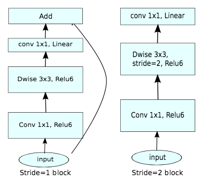*MobileNetV2 layers. Source: [Sandler et al. (2018)](https://arxiv.org/abs/1801.04381)*

This model has been trained with different datasets to solve several tasks. It has reached better performances than the MobileNetV1 on the 2012 ImageNet dataset for [image classification](https://medium.com/comet-app/review-of-deep-learning-algorithms-for-image-classification-5fdbca4a05e2) with less parameters. [Sandler et al. (2018)](https://arxiv.org/abs/1801.04381) have also used a SSDLite model for [object detection](https://medium.com/comet-app/review-of-deep-learning-algorithms-for-object-detection-c1f3d437b852) replacing convolutions with separable convolutions. According to the authors, they have combined SSDLite and MobileNetV2 models and trained them with the COCO dataset. They have achieved better performances than the YOLOv2 model for real-time object detection while reducing the number of parameters by 10 times. The same way, they have adapted an existing model for image segmentation, combined it with MobileNetV2 and train them over the 2012 PASCAL VOC dataset. They have obtained worse performances than a benchmark model but they have reduced the number of parameters by almost 30 times allowing embedding on mobile.

# Conclusion
To conclude, model reduction is essential for deep learning embedded on mobile. We could use either deep compression methods, specific architectures with a low number of parameters, or both. Both methods create small models with potentially high accuracy. However, a trade-off is made between lightweight and performances, and the good balance will depend upon the application.

[^1]: Although, we might consider later training a model for each individual.
[^2]: The first and the last layers keep full-precision weights while the others have ternary parameters.
[^3]: [Iandola et al. (2016)](http://arxiv.org/abs/1602.07360) have published a top-1 score of 57.5%.
[^4]: The final model of 0.47 MB has around 0.4 million parameters.
[^5]: The number of feature maps is divided by 4 times.