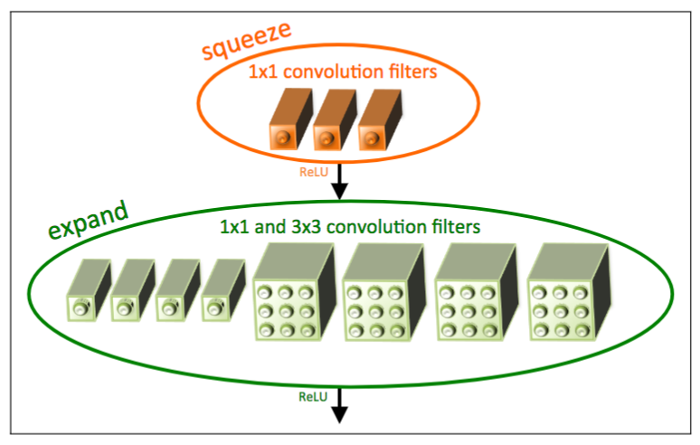
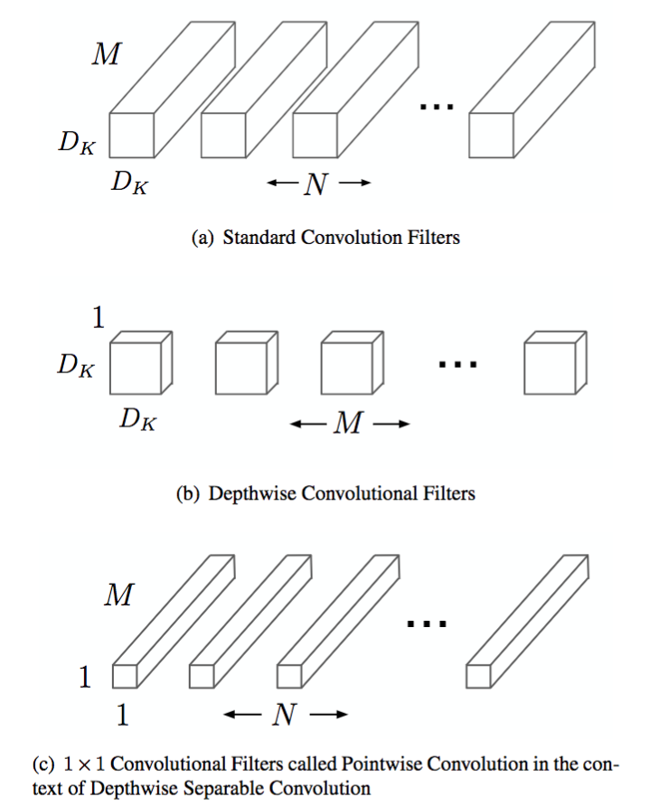
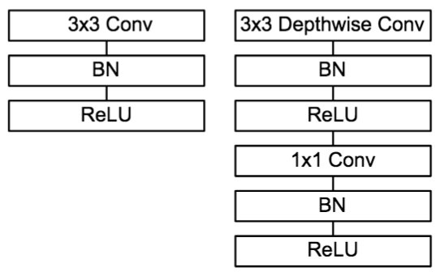
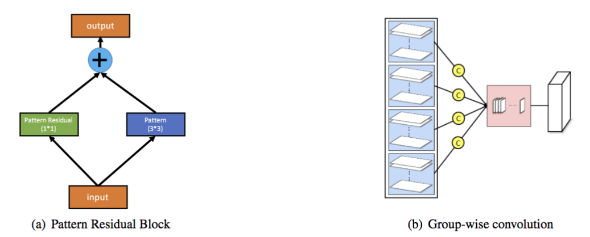
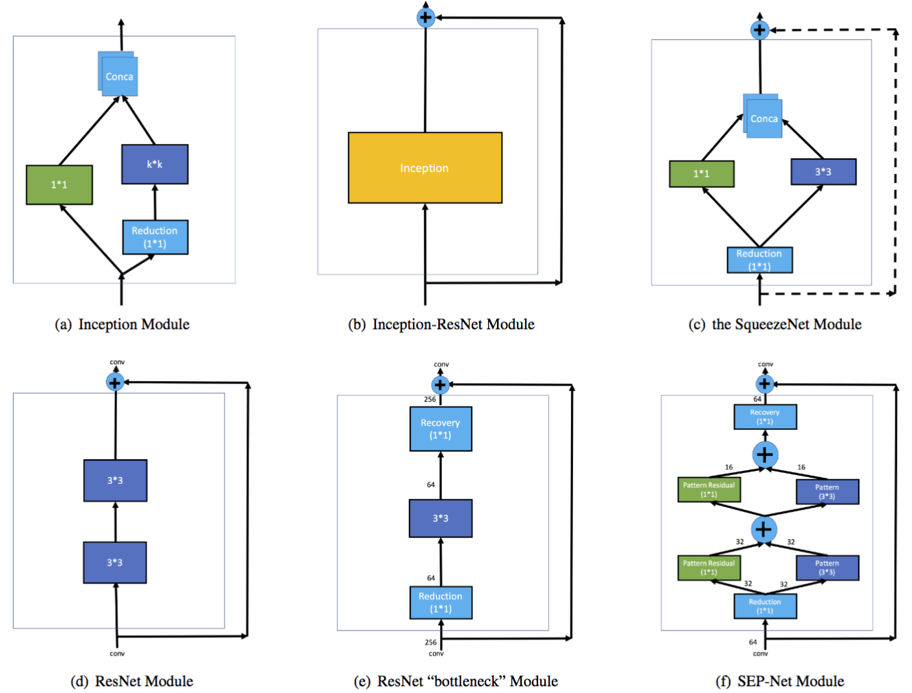

# Related Work for Deep Learning Model Compression

As stated in the introduction, we aim at embedding deep learning models directly within user's smartphones to guarantee their privacy. This induces multiple constraints for these models known to be heavy and greedy in energy. Fortunately, they will however be used only for inference\footnote{Although, we might consider later training a model for each individual}. Nevertheless, the computational cost is high even for inference and requires a lot of energy. This section describes theoretical methods to reduce model size. Size reduction for deep learning models is an active field of research. Unfortunately, while performant, this specific type of machine learning models involves extremely deep and complex architectures (\cite{simonyan_very_2014}, \cite{he_deep_2015}, \cite{szegedy_inception-v4_2016}). How can we simply transform a deep model into a lighter one without decreasing dramatically its performances ?

## Deep Compression
[Han et al. (2015)](http://arxiv.org/abs/1510.00149) have developed a method called "deep compression" to reduce the size of a deep learning model. Their experiments have empirically shown that the deep compression have no significant impact on the performances of the model while reducing its size by a factor from 35 to 49. The pipeline is decomposed into three independent tricks realized consecutively: network pruning, trained quantization and Huffman encoding.

*Pipeline of the Deep Compression with the cumulated factors of size reduction. Source: [Han et al. (2015)](http://arxiv.org/abs/1510.00149)*

### Network Pruning
As initiated in [Han et al. (2015)](http://arxiv.org/abs/1510.00149), network pruning consists in fine tuning the weights of a pretrained network while keeping only the relevant ones. After training a network using a standard method, the small weights (in absolute value) below a threshold are removed. The original dense network is transformed in a sparse one preserving the most important connexions. The model is retrained while fixing the removed weights to 0. The pruning process is applied again until the remaining weights have high values. [Han et al. (2015)](http://arxiv.org/abs/1510.00149) have experimented this method reducing the number of parameters by $9\times$ and $13\times$ for the AlexNet (\cite{krizhevsky_imagenet_2012}) and the VGG16 (\cite{simonyan_very_2014} models respectively.

### Trained Quantization
As explain in the pipeline of [Han et al. (2015)](http://arxiv.org/abs/1510.00149), the quantization method is applied over the weights of the model after its pruning but the two methods can be applied independently. A clustering is realized over the 32-bits weights (floats) and the centroids of each cluster are stored over 2-bits units (integers) in a "code book". The original weights are replaced with the centroid of their associated cluster. Thus multiple weights have the same values. This is called "Weight Sharing" because the model have to store only the common value of multiple weights one time and create links to use them. Like the network pruning method, the quantization is applied as a loop by retraining the network and realizing gradient updates in clusters mentioned above. After the updates, the centroids are stored in 32-bits float to preserve precision. According to [Han et al. (2015)](http://arxiv.org/abs/1510.00149) experiments, the quantization method should be able to reduce the number of weights by $18\times$.

*Shared weights (centroids) after clustering from quantization (top) and centroids fine tuning (bottom). Source: [Han et al. (2015)](http://arxiv.org/abs/1510.00149)*

### Huffman Encoding
The previous step provides weights with a discrete distribution from the centroids of the clusters. The Huffman code is a well-known method for lossless data compression. It stores discrete values by occurrence and each value is associated to a common symbol. The higher the frequency of a character, the fewer the storage on bits. This method reduces considerably the storage requirements using the sparse matrix indices. According to the experiments of [Han et al. (2015)](http://arxiv.org/abs/1510.00149), the Huffman encoding reduces the global model size by $8\times$ to $18\times$ while keeping the performances unchanged.

*Distribution of the weights after quantization (left) and indices of sparse matrix after Huffman encoding (right). Source: [Han et al. (2015)](http://arxiv.org/abs/1510.00149)*

## Specific Architectures
Even if methods for model reduction are efficient, architectures of deep neural networks can also be optimized. In this section, recent architectures for small deep neural networks are developed. This type of models are known to have performances close to the state-of-the-art while having fewer number of parameters to train and infer faster.

### SqueezeNet
[Iandola et al. (2016)](http://arxiv.org/abs/1602.07360) have been inspired from \cite{szegedy_going_2014} and their "inception module" in the GoogLeNet model detailed in section \ref{image_classification_related_work}. They have designed a new block called "Fire module" w.r.t. three strategies. The convolutional layers use $1\times 1$ filters instead of several $3\times 3$ filters to reduce the number of parameters by $9\times$ for each layer. The Fire module uses fewer filters than classical architecture inducing fewer number of input channels for each layer and thus less parameters. The downsampling using pooling layers is applied lately in the network (close to the output) to increase accuracy without being greedy in the number of parameters used. Formally, the Fire module is a "squeeze" convolutional layer followed by an "expand" convolutional layer. The squeeze layer contains convolutional layers with $1\times 1$ filters with the same input and producing stacked outputs. In the same way, the expand layer contains convolutional layers with $1\times 1$ and $3\times 3$ filters. In a Fire module, the number of filters in the squeeze layer has to be inferior to the total number of filters in the expand layer.

*Example of Fire module. The squeeze layer has three $1\times 1$ conv filters. The expand layer has four $1\times 1$ conv filters and four $3\times 3$ conv filters. Source: [Iandola et al. (2016)](http://arxiv.org/abs/1602.07360)*

The SqueezeNet model has a specific architecture using convolutional layers, pooling layers and Fire modules. A convolutional layer takes an image as input followed by 10 Fire modules and a final convolution layer before the softmax layer. In their experiments, the authors have reached the same performances as the AlexNet model (240 MB) (\cite{krizhevsky_imagenet_2012}) over the ImageNet challenge\footnote{[Iandola et al. (2016)](http://arxiv.org/abs/1602.07360) have published a top-1 score of 57.5\%} while reducing the number of parameters by $50\times$ (4.8 MB model). After applying the Deep Compression of \cite{han_deep_2015} detailed above, they have also obtained the same performances than the AlexNet with $510\times$ less parameters\footnote{The final model of 0.47 MB has around 0.4 million parameters.} (0.47 MB model).

*SqueezeNet architectures. Left: classic SqueezeNet architecture (57.5\% top-1 accuracy). Right: SqueezeNet with residual connection (60.4\% top-1 accuracy). Source: [Iandola et al. (2016)](http://arxiv.org/abs/1602.07360)*

### MobileNets
[Howard et al. (2017)](http://arxiv.org/abs/1704.04861) have developed a group of small models called MobileNets for vision applications embedded on mobile. They have built models which are a trade-offs between speed and accuracy to match different purpose. 

\medskip
The MobileNets architecture is base on the "depth-wise separable" convolution similar to factorized convolution. First, a classic convolution with a filter with a fixed size ($3\times 3$ for example) is applied over all the input producing the same number of feature maps, it is the depth-wise convolution. Then convolutions with $1\times 1$ filters are used over each feature map, it is the point-wise convolution. Factorizing initial convolutions with $1\times 1$ filters reduces dramatically the number of parameters.

*Example of depth-wise separable filter construct with a depth-wise convolution and a $1\times 1$ point-wise convolution where $M$ is the depth of the input, $N$ the number of feature maps and $D_K$ the width and height size of a square feature map. Source: [Howard et al. (2017)](http://arxiv.org/abs/1704.04861)*

The first layer of a MobileNet model is a classic convolutional layer taking an image as input. Then 13 depth-wise separable convolutions (2 layers each) follow each other. An average pooling layer links the feature maps and a fully connected layer with a softmax compute the predictions. All in all, a MobileNet has 28 layers each one followed by a batch normalization and a ReLU nonlinearity except the fully connected.

*Left: classic convolutional layer with batch normalization and ReLU nonlinearity. Right: depth-wise separable layer with batch normalization and ReLU nonlinearity after each depth-wise and point-wise convolutions. Source: [Howard et al. (2017)](http://arxiv.org/abs/1704.04861)*

MobileNets have variable speed and accuracy depending on two hyper-parameters. The "width multiplier" is a value between 0 and 1 thinning each layer by reducing the number of input and output channels. The "resolution multiplier" is an integer value corresponding to the size of the input image and the internal representations to reduce the computational cost. With the highest values of width and resolution multipliers, the MobileNet model has 4.2 million parameters and [Howard et al. (2017)](http://arxiv.org/abs/1704.04861) have published a top-1 score of 70.6\% over the ImageNet challenge. With a width multiplier of 0.25\footnote{The number of feature maps is divided by $4\times$.} and a fixed resolution multiplier of 1, the top-1 accuracy is 50.6\% with 0.5 million parameters and a model $14\times$ faster than the previous one. If the width multiplier is fixed and the resolution multiplier is decreased, the number of parameters doesn't change but the models are faster for a slight decrease of the accuracy. A trade-off between these two hyperparameters can be found for different applications and their expectations.

### SEP-Net
[Li et al. (2017)](http://arxiv.org/abs/1706.03912) have focused their work on both side: model compression method and block architecture for small CNNs.

They propose a new approach called "pattern binarization" to binarize specific weights instead of quantize or binarize all of them. Only $k\times k$ ($k>1$) filters of convolutional layers used for pattern extraction are binarized. Note that $1\times 1$ filters are used for data transformation and they need to keep information as much as possible. Thus the method is the following: they train their model the usual way, then they binarize the $k\times k$ convolutional filters and finally they fine tune the model with binary values for $k\times k$ filters and floating points for $1\times 1$ filters using the same dataset.

[41_binarization_ex](41_binarization_ex.png)*Example of binarized $3\times 3$ convolutional filter. Source: [Li et al. (2017)](http://arxiv.org/abs/1706.03912)*

To design a new block for small CNNs, the authors have developed a "Pattern Residual Block" (PRB). It is composed of a convolutional layer with $1\times 1$ filters and a convolutional layer with $3\times 3$ filters executed in parallel. The feature maps produced by the two layers are added together. Moreover they use group-wise convolution, splitting the input feature maps of a convolutional features in N ($N=4$ in their implementation). The convolutions are applied on each of this subgroup of input data. This method reduces the number of parameter by $N\times$.

*Left: Pattern Residual Block, Right: Group Wise Convolution. Source: [Li et al. (2017)](http://arxiv.org/abs/1706.03912)*

The "SEP-Net module" consists of a convolutional layer with $1\times 1$ filters followed by two PRBs and a final convolutional layer with $1\times 1$ filters. The first layer is a dimension reduction layer while the last one is a dimension recovery layer. This way, a residual connection is constructed between the input of the block and the output of the last layer. The SEP-Net model alternates SEP-Net module and convolutional layer to feed a fully connected layer with a softmax for classification.

*Comparison between well-known architecture of blocks. Source: [Li et al. (2017)](http://arxiv.org/abs/1706.03912)*

](http://arxiv.org/abs/1706.03912)*

[Li et al. (2017)](http://arxiv.org/abs/1706.03912) have highlighted the relevance of the pattern binarization by reducing the number of parameters of the GoogLeNet model by almost $2\times$. It has only decreased the top-1 accuracy by 3\% over the 2012 ImageNet challenge. The SEP-Net model has a top-1 accuracy of 65.8\% close to the reduced GoogLeNet for a 5.2 MB model with 1.3 million parameters. According to their implementation, the SqueezeNet model (1.2 million parameters, 4.8 MB) has a top-1 accuracy of 60.4\% and the MobileNet (1.3 million parameters, 5.2 MB) has an accuracy of 63.7\% which made the SEP-Net the state-of-the-art of small CNNs.

To conclude, model reduction is essential for deep learning embedded on mobile. We could use either deep compression methods, specific architectures with a low number of parameters, or both. Both methods create small models with potentially high accuracy. However, a trade-off is made between lightweight and performances, and the good balance will depend upon the application.